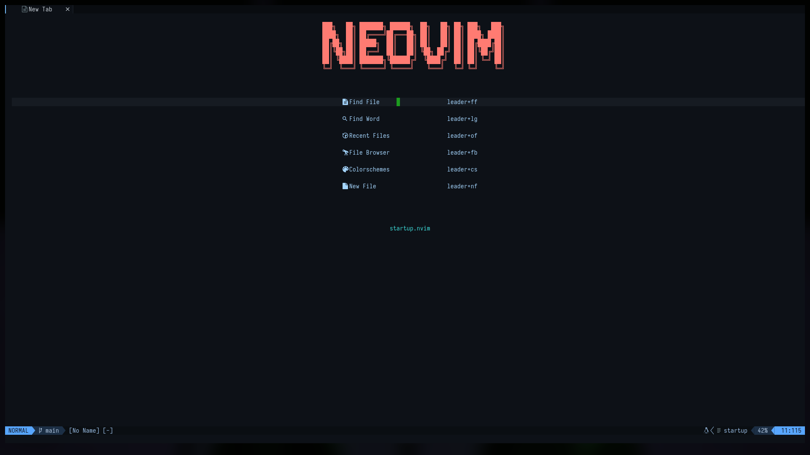
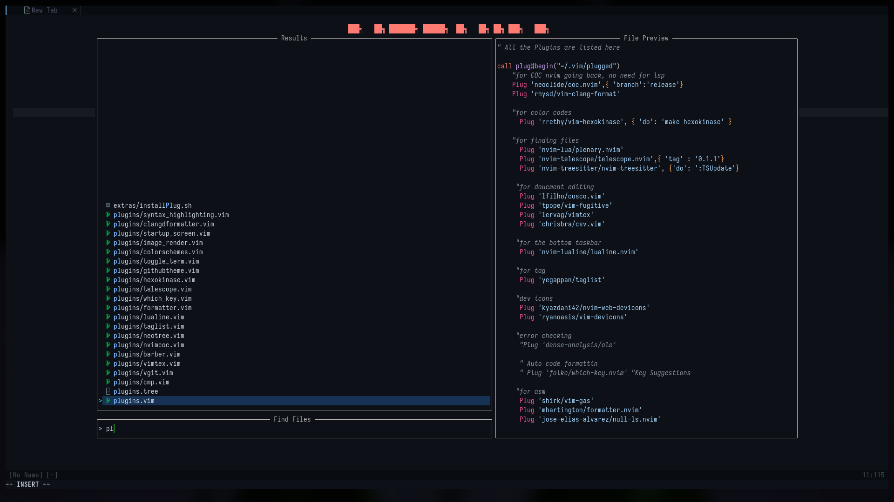

# my nvim config

# images

### extras folder

> anything ending in .tree has a layout of how everyfile is linked

> if you dont have `PlugInstall`, the script `plugInstall.sh` will install it

> `setup.sh` will automatic configure this for you and me

### extra info

> it has unlimited undo's enabled but must create the folder in `~/.config/nvim/undodir/`

> layout tree in `./extras/layout.txt`

> run to install plugInstall : `./extras/installPlug.sh`
